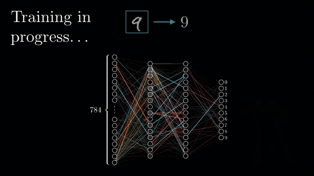
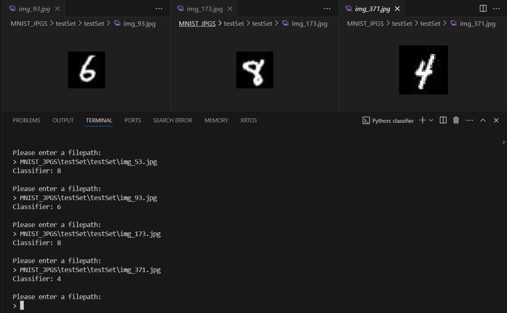

# 🔢 Neural Network Classifier for MNIST Dataset

<div align="center">
  
</div>

## Overview

This project implements a neural network classifier for recognizing handwritten digits using the MNIST dataset. The neural network architecture consists of two hidden layers with ReLU activation functions and a softmax output layer for multi-class classification.

## 🚀 Features

- 🤖 Neural network classifier for digit recognition
- 📊 Training and evaluation with accuracy metrics
- 🖼️ Input Image Predictions

## 📂 Files

- **classifier.py**: Contains the implementation of the neural network model, training, and inference functions. It also handles user input for making predictions on custom images.
- **Report.pdf/**: Report containing neural network implementation details.
- **MNIST_JPGs/**: Subdirectory containing images for testing the classifier.

## 📸 Screenshots



## 🔧 Installation

Follow these steps to set up the project locally.

### Prerequisites

- 🐍 Python 3.x
- 📦 numpy
- 📦 matplotlib
- 📦 torch
- 📦 torchvision
- 📦 PIL (Python Imaging Library)

### Installation Steps

1. **Clone the repository**:
   ```sh
   git clone https://github.com/LuthoYRN/digit-classifier.git
   ```
2. **Navigate to the project directory**:
   ```sh
   cd digit-classifier
   ```
3. **Install dependencies**:
   ```sh
    pip install numpy matplotlib torch torchvision Pillow
   ```

## 🏃 Usage

### Running the Classifier

1. **Train the Classifier**:
   ```sh
   python classifier.py
   ```
   The program will prompt you to enter an image path when training is done. Enter the relative path to the image of the digit to be classified.

## 📌 Note

- Ensure you have all the required libraries
